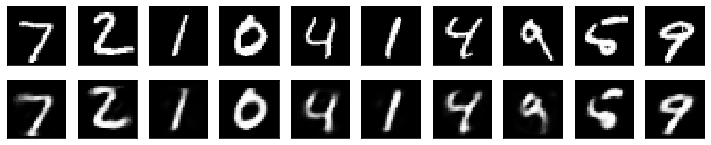
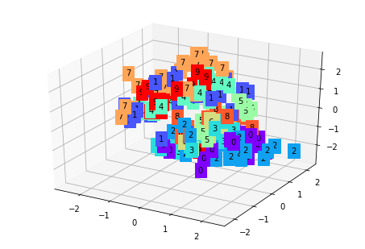
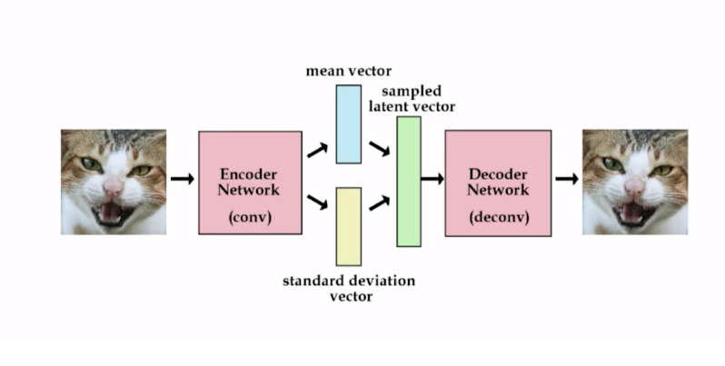

# Basic AutoEncoders

implementation of various autoencoder

- [Linear autoencoder](linear_autoencoder)
- [simple autoencoder](simple_autoencoder)
- [Deep Auroencoder](deep_autoencoder)

#[Denoising auroencoder](denoising_autoencoder)

# [Variation autoencoder](variational_autoencoders)
This is a variation of autoencoder which is generative model.
The main difference of variational autoencoder with regular autoencoder is that the encoder output is a mean vector and variance vector.
Then it is used to generate latent vector which is passed to Decoder network

