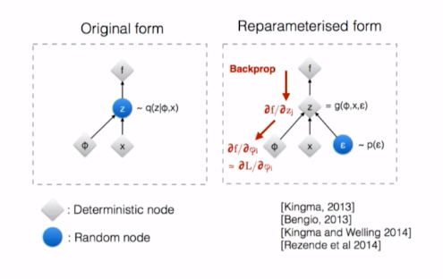
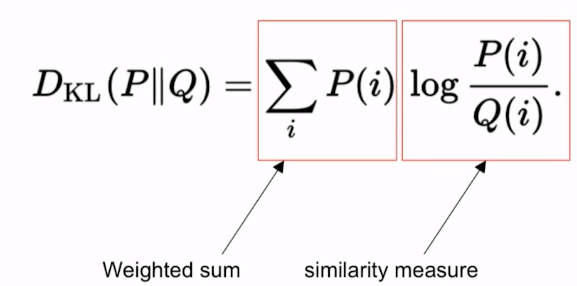
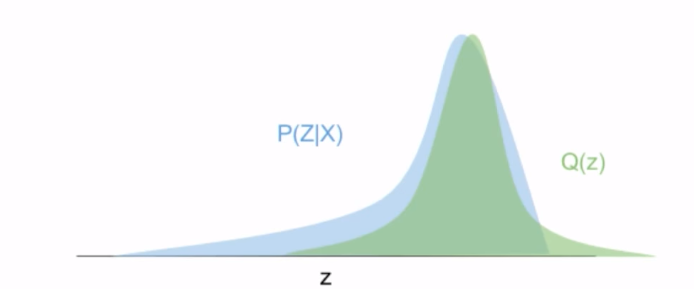
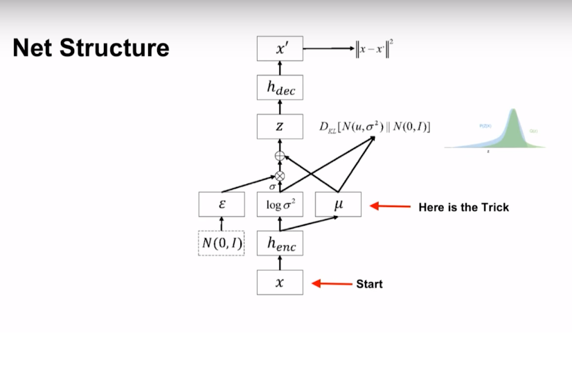

# Variation autoencoder
This is a variation of autoencoder which is generative model.
The main difference of variational autoencoder with regular autoencoder is that the encoder output is a mean vector and variance vector.
Then it is used to generate latent vector which is passed to Decoder network

But here the sampled vector is random and we can not back propagate through it. So, the solution is "Re-Parameterization Trick"

Here the author added some random noise multiplied it with std and added to mean. which is overall random sampling, but it is now a linear equation and we can back prop through it
Here is some resource about this 

http://stats.stackexchange.com/a/205336
http://dpkingma.com/wordpress/wp-content/uploads/2015/12/talk_nips_workshop_2015.pdf

## KL-Divergence
Basically this is weighted some of some similarity measurement

Which is similar to pushing one distribution towards other

So, the full architecture of the autoencoder net is like
